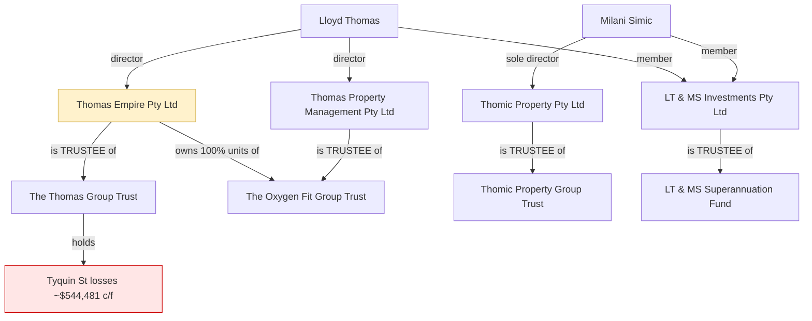

# Entity wind-up — dependency chain summary

**Prepared:** 2026-07-04 · **For:** the accountant (J. Giuffre & Co) and Lloyd/Milani's own reference
**This is a plain-language map of how the entities depend on each other, assembled from the source documents. It is NOT tax or legal advice — the ordering and mechanics of any deregistration must be confirmed with the accountant and/or a lawyer.**

---

## The one-paragraph version

Lloyd's plan is to let several companies be deregistered (in some cases simply by not paying ASIC fees) while keeping the **tax losses** and the **trust structures** available for the future. The catch is that **three of the "companies" are also trustees of trusts, and one of them owns 100% of another trust.** So deregistering a company does not just remove that company — it can **orphan a trust of its trustee** and **strand a valuable asset (units, or ~$544k of carried-forward losses) inside a dissolved entity.** Nothing here is necessarily fatal to the plan, but the **order of operations matters**, and doing it blind risks forfeiting the very losses the plan is meant to preserve.

---

## The players (and the two hats problem)

| Entity | Type | Role(s) | Key proof document |
|---|---|---|---|
| **Thomas Empire Pty Ltd** | Company | (a) standalone company; (b) **trustee of The Thomas Group Trust**; (c) **holder of 100% units in The Oxygen Fit Group Trust** | `entities/thomas-empire-pty-ltd/profile.md`; unit holding in `entities/thomas-property-management-oxygen-fit/tpm_register_of_units.pdf` |
| **The Thomas Group Trust** | Trust | The property-developer trust that **holds the Tyquin St losses (~$544,481 c/f)**; trustee = Thomas Empire Pty Ltd | `consolidated-annual-booklets/taxation_booklet_fy2025.pdf` (Trust Tax Return 2025, names trustee + losses c/f); `entities/thomas-group-trust/profile.md` |
| **Thomas Property Management Pty Ltd** | Company | **Trustee of The Oxygen Fit Group Trust** | `entities/thomas-property-management-oxygen-fit/tpm_asic_company_extract.pdf`, `tpm_trust_deed.pdf` |
| **The Oxygen Fit Group Trust** | Trust | Administered by Thomas Property Management; **100% of its 120 units owned by Thomas Empire Pty Ltd** (since 28/11/2012) | `entities/thomas-property-management-oxygen-fit/tpm_register_of_units.pdf`, `tpm_transfer_of_units.pdf`, `oxygen_fit_group_trust_deed.pdf` |
| **Thomic Property Pty Ltd** | Company | **Trustee of Thomic Property Group Trust**; sole director **Milani Simic** | `entities/thomic-property-pty-ltd/thomic_member_resolution_constitution.pdf` |
| **Thomic Property Group Trust** | Trust | Milani's trust (settled 21/06/2018); beneficiaries Milani, Lloyd, future children; trustee = Thomic Property Pty Ltd | `entities/thomic-property-pty-ltd/thomic_trust_deed.pdf` |
| **LT & MS Investments Pty Ltd** | Company | **Corporate trustee of the LT & MS Superannuation Fund (SMSF)** | `entities/smsf/profile.md`, `entities/smsf/2021/smsf_setup_fee_2021.pdf` |
| **LT & MS Superannuation Fund** | SMSF | Lloyd & Milani's self-managed super fund; holds crypto | `entities/smsf/koinly_2024_complete_tax_report.pdf` |

**The core issue:** every "company" in the left column with a trust next to it is wearing **two hats** — it is both an entity in its own right *and* the trustee (or 100% unitholder) of a trust. A trust cannot operate without a trustee. So removing the company removes the trust's trustee.

---

## The dependency chain, drawn out

Read it as: **kill a yellow/box company and you affect everything it points to.**

---

## What breaks if you deregister each company

### 1. Thomas Empire Pty Ltd — the most tangled, do NOT deregister casually
Deregistering Thomas Empire Pty Ltd does **three** things at once:
- **(a) Removes the trustee of The Thomas Group Trust** — the trust that holds the **~$544,481 of Tyquin St tax losses** Lloyd wants to keep. The losses belong to the *trust*, not the company, so **deregistering the company does not by itself destroy the losses** — but the trust is left with **no trustee**, and a trust generally needs an active trustee to continue and to ever actually **use** those losses. A replacement trustee would need to be appointed for the losses to have any future value.
- **(b) Strands its 100% unit holding in The Oxygen Fit Group Trust.** Those 120 units are an **asset of Thomas Empire**. When a company is deregistered, its property does not vanish — it typically **vests in ASIC** as unclaimed property (`entities/thomas-property-management-oxygen-fit/profile.md` raises exactly this). Recovering it later is a process, not automatic.
- **(c) Removes a standalone company** that was also the legal vendor of the two **39 Powlett St** sales (`properties/powlett-st/findings.md`), so any residual obligations tied to those sales should be checked before it disappears.

> ⚠️ **This is a three-way tangle** (Thomas Empire ↔ The Thomas Group Trust ↔ The Oxygen Fit Group Trust), not a simple one-company deregistration. Whether the "let ASIC deregister it and keep the losses" plan works depends on: (i) appointing a new trustee for The Thomas Group Trust so the losses survive with a usable home; (ii) dealing with the Oxygen Fit unit holding **before** deregistration so it doesn't vest in ASIC; and (iii) the trust-loss continuity rules (whether the losses can legally be carried forward and used at all — an accountant question, not answered here).

### 2. Thomas Property Management Pty Ltd — can't be done independently of #1
This company is **trustee of The Oxygen Fit Group Trust**. But Oxygen Fit is **100% owned by Thomas Empire Pty Ltd**, so retiring Thomas Property Management is entangled with what happens to Thomas Empire (#1). Retirement blocker on the car has been cleared (`2026/kia_transfer_agreement_executed.pdf`, `kia_board_resolution.pdf`), but the **trustee-of-a-still-owned-trust** problem remains. Order matters: if Thomas Empire is deregistered first, the units it holds in this trust become ASIC's problem.

### 3. Thomic Property Pty Ltd — Milani's, same orphaned-trustee issue
Milani is **sole director** of Thomic Property Pty Ltd, which is **trustee of Thomic Property Group Trust** (`thomic_member_resolution_constitution.pdf`, `thomic_trust_deed.pdf`). Lloyd's stated intent is to deregister the company **but keep the trust for future use.** Those two goals conflict on their face: **deregistering the trustee company removes the trust's only trustee.** To "keep the trust for future use," a **replacement trustee** would need to be appointed — ideally **before** deregistration, or as part of reviving the structure later. Confirm with the accountant/lawyer exactly what "retain for future use" requires here.

### 4. LT & MS Investments Pty Ltd — leave it alone while the SMSF is live
This is the **corporate trustee of the SMSF**. An SMSF **must** have a trustee at all times to remain compliant. Deregistering this company while the fund holds assets (crypto, per the Koinly reports) would leave the fund **without a trustee** — a compliance problem. This company should **not** be deregistered unless/until the SMSF itself is wound up or a replacement trustee is in place.

---

## Suggested sequence to raise with the accountant (not advice — a checklist of dependencies)

The documents suggest the following **dependencies** that any wind-up plan has to respect. This is a list of *what has to be true before what*, not a recommendation to proceed:

1. **Before touching Thomas Empire Pty Ltd:**
   - Appoint a **new trustee** for The Thomas Group Trust (so the ~$544,481 losses keep a usable home), **and**
   - Deal with the **Oxygen Fit Group Trust units** (transfer them out of Thomas Empire, or wind up Oxygen Fit) so they don't vest in ASIC, **and**
   - Confirm the **trust-loss continuity/pattern-of-distributions rules** actually allow those losses to be carried forward and used — otherwise preserving them is moot.
2. **Thomas Property Management Pty Ltd** can only be retired once the Oxygen Fit unit/trustee position (tied to Thomas Empire) is resolved.
3. **Thomic Property Pty Ltd** — appoint a replacement trustee for Thomic Property Group Trust first if the trust is genuinely to be kept.
4. **LT & MS Investments Pty Ltd** — do not deregister while the SMSF is active and holding assets.
5. **Cross-cutting:** two returns were **amended** (Thomas Empire FY2023, Thomic FY2023) — understand why before closing anything, in case an amendment reflects an unresolved issue.

---

## Open questions the documents can't answer (for Lloyd + accountant)

- **Trust-loss rules:** can The Thomas Group Trust's ~$544,481 losses actually be carried forward and used after a trustee change? (Trust loss measures — income injection, continuity, pattern of distributions — are outside these documents.)
- **ASIC deregistration mechanics:** what actually happens to Thomas Empire's Oxygen Fit units on deregistration, and how are they recovered? (`profile.md` flags vesting in ASIC as the likely outcome.)
- **Inalaa Pty Ltd:** an undocumented company that was the 2018 purchaser of Ocean Grove (`property-sales/ocean-grove/findings.md`). Not in the entity list, no ASIC/deed on file — needs identifying, as it may be another entity to account for.
- **Order of operations:** whether any single ordering avoids both orphaned trusts and stranded assets — a question for the accountant/lawyer.

---

## Source files

- `entities/thomas-empire-pty-ltd/profile.md`
- `entities/thomas-group-trust/profile.md`
- `entities/thomas-property-management-oxygen-fit/profile.md` (+ `tpm_register_of_units.pdf`, `tpm_transfer_of_units.pdf`, `oxygen_fit_group_trust_deed.pdf`, `tpm_asic_company_extract.pdf`, `2026/kia_transfer_agreement_executed.pdf`)
- `entities/thomic-property-pty-ltd/profile.md` (+ `thomic_trust_deed.pdf`, `thomic_member_resolution_constitution.pdf`)
- `entities/smsf/profile.md` (+ `2021/smsf_setup_fee_2021.pdf`)
- `consolidated-annual-booklets/taxation_booklet_fy2025.pdf` (Thomas Group Trust return + losses c/f)
- `tyquin-st-loss-summary.md`, `property-sales/ocean-grove/findings.md`, `properties/powlett-st/findings.md`
